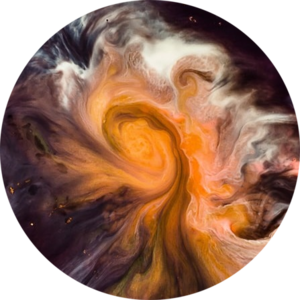

# DreamTime

DreamTime is an application that allows you to use the power of your CPU or GPU to transform photos of people and get free entertainment, the goal of DreamTime is to offer a **CLI** to process photos from the console and a new **GUI** (Graphical user interface) to use the program easily.

- The CLI version allows you to transform photos using commands, with this you can create automated systems such as _bots, web pages or a new GUI_. Use the argument `--help` to get more information about usage, keep in mind that the CLI by itself **does not have** a cropping system so you will have to manually resize your photos to 512x512

- The GUI version is a new friendly interface that includes a cropping system, so you only have to tell the program which photo you want to transform and you will get results in a few clicks.

## Community

Join the community of people who use the project either for entertainment or development purposes, you can get valuable help or create interesting discussions to improve the future of DreamTime:

- [Discord](http://bit.ly/32nnbdb)

## Backups

To avoid the loss of the project and the code, it will be hosted at the following sites:

- [Github](http://bit.ly/2GfuzxM) (Requires having a Github account)
- ~~[Bitbucket](https://bitbucket.org/deepmanyy/easydeepnude/src)~~
- ~~[Gitlab](https://gitlab.com/deepmanyy/easydeepnude)~~
- [NotABug](http://bit.ly/2LrezwX)
- [GitGud](http://bit.ly/2LRZyDM)

Remember that you can follow the project or make a fork and create your own version! Read the [LICENSE](LICENSE.md) for more information.

# Alpha

DreamTime is in an alpha version so it can be unstable or not work directly under certain conditions (which I often do not know)

I will try to help in any problem you have.

---

# 💜 Binaries

## Requirements

- Windows 10 - 1809+ - 64 bits
- Ubuntu 17+ - 64bits
- **8 GB** of RAM or more.

> ⚠ **N versions of Windows 10** require installing the [Media Feature Pack](https://www.microsoft.com/en-us/software-download/mediafeaturepack).

## GPU Processing Requirements

> 👉 If you do not have an NVIDIA or compatible graphics card you can use CPU processing.

- NVIDIA Graphics card with CUDA compatibility
- [Latest NVIDIA drivers](https://www.nvidia.com/Download/index.aspx)
- [CUDA 10.0](https://developer.nvidia.com/cuda-10.0-download-archive) *(CUDA can be optional on the latest graphics cards)*

## Download

Download DreamTime is very easy! 2 files and you are ready. *(Get ready to download ~3GB)*

- [CLI & GUI](http://bit.ly/2Gcr9LU): The command line interface (CLI) and the graphical user interface (GUI), here you will find everything you need, just download the .zip file that fits your operating system.
- 👉 [Checkpoints](http://bit.ly/2JBP88o): This is the information that the transformation algorithm **requires**, if you do not have this file the application will not work. You only need to download it once, if you update DreamTime use this same file for checkpoints. (unless we tell you otherwise)

## Download Mirrors

- [CLI & GUI (MEGA)](http://bit.ly/2YQAEI1)
- [CLI & GUI (MediaFire)](http://bit.ly/2YQAHnb)
- [Checkpoints (MEGA)](http://bit.ly/30GiSbh)
- [Checkpoints (MediaFire)](http://bit.ly/2Y0V6sO)

## Installation

- Create a folder on your computer, it can be anywhere you want it, call it `DreamTime` and inside it place the 2 zip files you have downloaded.
- Extract the file that contains the CLI and the GUI, this should generate 2 folders: one called `cli` and another one called `gui`
- Extract the other file `checkpoints.zip` and move the extracted folder `checkpoints` inside `cli`.
- Ready! Now you can run `gui/DreamTime.exe` and transform all the photos you want. If you want to use the command line interface run the `cli/cli.exe` file from a console.

> ℹ When you update DreamTime it will only be necessary to download the file that contains the `CLI & GUI`, you can reuse the checkpoints (unless we tell you otherwise)

## F.A.Q.

Q: Why does the program ask for firewall permissions?

A: For now the GUI needs to create a local server on your computer to render the interface of the program, basically the GUI is a web browser. Yes I am aware that this method is "retarded" but it is temporary. No, it's not a virus, a botnet or anything like that, I'm not interested in your photos or your files.

---

# About the Author

I am a web developer who found this application interesting and I could not resist making it as accessible as possible to the world.

I know that the project is not ethical and can generate unwanted results for many people, but the truth is that I am a lover of black humor, satire and I believe that anyone can do what they want, not all are equal and there will be people who give them a private or important use to this project.

In the end what they do with that is not of my interest and I do not take responsibility for their misuse.

The source code of this project must be open and free forever.

> If you want to support the development of this project and obtain advantages please consider: 💖[Become a patron](http://bit.ly/2Y7Wqd8).

Email: `deepmanyy[at]msgsafe.io`

4chan: `!!ZOXIOrD0Ory`

Discord: `DeepManYY#5508`

---

# 💻 Development > 🚧 Area only for developers!

## Requirements

- [CUDA 10.0](https://developer.nvidia.com/cuda-10.0-download-archive)
- [Python 3.6](https://www.python.org/downloads/release/python-368/)
- [NodeJS 10+](https://nodejs.org/en/)
- [Yarn](https://yarnpkg.com/en/docs/install)

## What should I know?

- [Python](https://www.codecademy.com/catalog/language/python): For the development of the CLI, the transformation algorithm and the neural network.
- [HTML & CSS](https://www.codecademy.com/catalog/language/html-css), [JavaScript](https://www.codecademy.com/catalog/language/javascript): For website development (The GUI is a website 😮)
- [VueJS](https://vuejs.org/), [NuxtJS](https://nuxtjs.org/): The frameworks that have been used to build the GUI. _(VueJS is the best #changemymind)_
- [Electron](https://electronjs.org/): The software used to "transform" the GUI from a website to a desktop program.

## Setup

> All the source code is inside the src/ folder, from now on all the instructions will be based on this folder.

### Quick Setup

Inside the folder `scripts/` you will find folders for the different supported operating systems, within each folder there is a series of scripts that will allow you to prepare the project for its development.

- **setup**: This script will install all the necessary requirements for Python and NodeJS. In theory you only need to run this script once per version.
- **build**: This script will compile the project in the `dist/` folder (generate the binaries for CLI and GUI), once finished you can compress the `dist/` folder and share it with the world.
- **dev-start**: This script will launch 2 processes, one to start the NuxtJS server (which will compile all the CSS, JavaScript and Vue files) and other that will start Electron that will load the NuxtJS server. Any change you make in `gui/` will be reflected in real time.

> ⚠ If you use [Anaconda](https://www.anaconda.com/) or some other program that encapsulates Python or NodeJS in their own development environment it is very likely that these scripts fail, you will have to read the content and execute the commands manually.

> ⚠ The NuxtJS server incorporates an HTTP server to view the live application in a web browser, **you must not access the web address indicated by the console**, the application only works when it is opened from Electron.

> 👉 The scripts for **macOS** are the same as those for Linux. [More information](src/scripts/mac/README.md).
